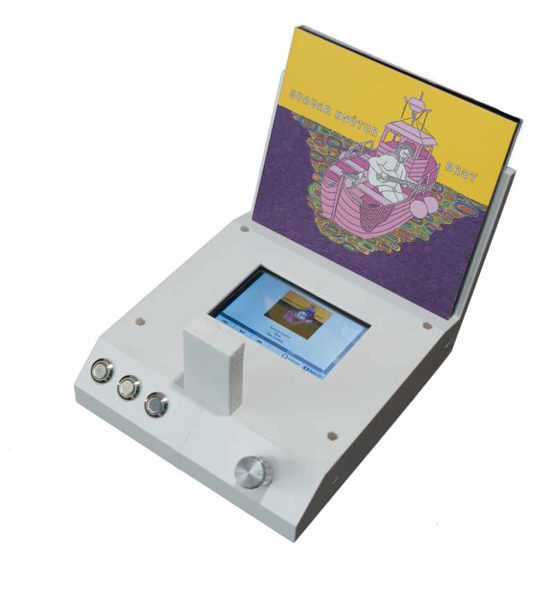
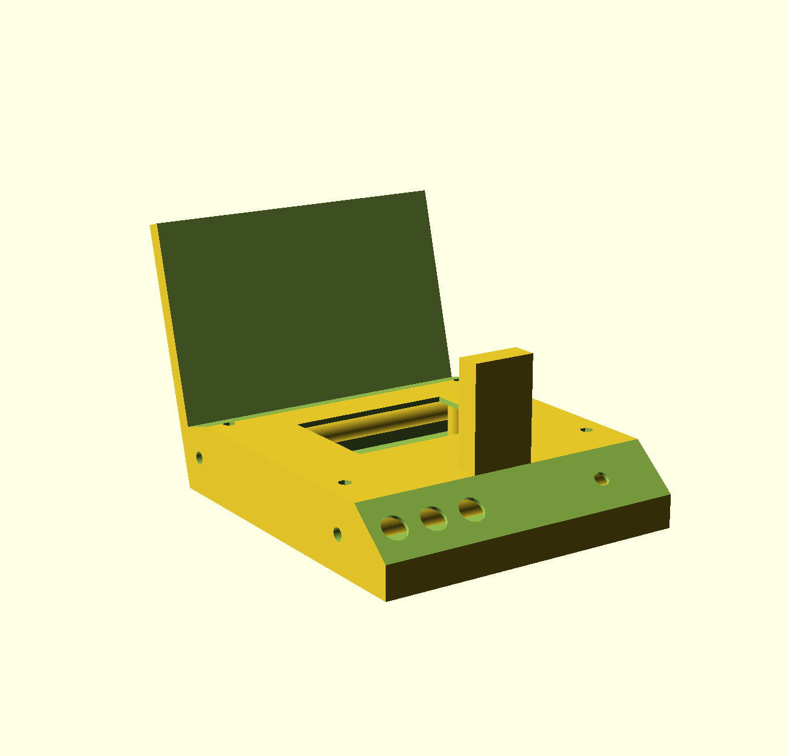

# gervifonn

The gervifonn is a device to access music stored in a digital music library by interacting with physical CD cases.

## Features
The gervifonn displays the currently playing album. You can change the volume, pause playback or skip to the previous/next song. When you put a CD case onto the gervifonn and press the knob, it uses an AI to recognize the album you want to play.

## Name
The name "gervifonn" derives from the icelandic words "gervigreind" (Artificial Intelligence) and "fónn" (Record Player).

## Assembly
See below for details of required parts and software. Assemble the gervifonn in the following order:
1. Install Raspberry Pi OS software on micro SD card and put micro SD card into Raspberry Pi
2. Configure Rasberry Pi OS for automatic login, enable wifi and ssh access and install the display drivers provided by the vendor
3. Install gervifonn software
4. Install pushbuttons, rotary encoder and knob
5. Connect camera cable to camera. Put together the right and left half of the case, fitting the camera into the camera holder and threading the power cord through the hole in the back of the case. Make a knot in the power cord as a strain relief. Use screws and nuts to secure
6. Use screws to fix Raspberry Pi on bottom part of the case
7. Connect the pushbuttons and the rotary encoder like this using the flat ribbon cable:

6. Connect the camera cable to the Raspberry Pi and install display
7. Insert bottom part of case and secure with screws and nuts
 

## Components
### Case

The case is 3D printed. The [OpenSCAD](https://www.openscad.org/) source and generated STL files can be found under [case](case). The case is made from three parts, for assembly 12 M3 bolts and 8 M3 nuts are needed.
### Hardware
The heart of the gervifonn is a [Raspberry Pi 3 B+](https://www.raspberrypi.org/products/raspberry-pi-3-model-b-plus/).
Additionally the following parts were used (links to amazon.de, not sponsored):
* [Raspberry Pi Camera Revision 1.3](https://www.amazon.de/gp/product/B07CMXJLXR/)
* [3.5 inch 320\*480 Resolution Touch Screen](https://www.amazon.de/gp/product/B01CNLYL1C/)
* [12mm pushbuttons](https://www.amazon.de/gp/product/B075YNQQ8J)
* [KY-040 Rotary Encoder](https://www.amazon.de/gp/product/B07CMVQHLT)
* [Knob for the Rotary Encoder](https://www.amazon.de/gp/product/B007JV6MAK)
* [10 Pin 2,54mm Pitch flat ribbon cable](https://www.amazon.de/gp/product/B07H9RQM5W/)
* A bit of extra wiring
* Micro-SD card
* Power supply for Raspberry Pi 3

### Software on the device
The gervifonn uses [Raspberry Pi OS](https://www.raspberrypi.org/software/) as a base.
The additional software running on the gervifonn can be found under [src](src). Install the requirements with `pip install -r requirements.txt` and place [src\gervifonn.desktop](src\gervifonn.desktop) into the /home/pi/.config/autostart/ directory of your raspberry. You might want to adapt the path to the gervifonn.py, the path to the music directory, the hostname of the [MPD](https://www.musicpd.org/) server, and the [https://github.com/badaix/snapcast](Snapcast) server and client.

### Software for training the AI
The AI-model needs to be trained on a more powerfull (linux) machine than a raspberry pi. A GPU with CUDA support is recommended, see [here](https://www.tensorflow.org/install/gpu#install_cuda_with_apt) for installation hints for the required libraries. Install the python libraries needed with `pip install -r training/requirements.txt`. To train the model use [training/train_gervifonn.py](training/train_gervifonn.py), with the path to your music folder and a folder with background images as arguments (details see below).
The resulting `gervifonn.tflite` model needs to be placed together with the generated `labels.txt` on your raspberry pi in the same folder as [src\gervifonn.py].

## Prerequesites
The gervifonn currently expects the following environment:
### Music library
The music library should be structured in the way [Jack](https://github.com/jack-cli-cd-ripper/jack) creates it, meaning one folder per Artist with subfolders for each album. Samplers are stored in the `Various` folder.

In addition, a cover image must be present in each folder, named `cover.png`. Optionally, you can place additional cover images in a subfolder called `gervifonn` inside each album. This will also be done by the gervifonn when you are using it.

As albums with multiple CDs only have one cover, only place the `cover.png` in the first folder and create symlinks called `next` linking to the following CD.

### Music Player Daemon
The actual playback of the music is handled by the (Music Player Daemon)[https://www.musicpd.org/]. The MPD should be configured to read in your music library and should be reachable from the gervifonn (without authentification). If you don't have an extra machine, it should be fine to install the MPD on the gervifonn as well.

### Scnapcast
The audio is streamed from the MPD via (Snapcast)[https://github.com/badaix/snapcast] to the actual playback devices. The volume of one Snapcast client can be controlled by the gervifonn.

## Configuration
### Software on the device
gervifonn.py requires the following arguments:
| Argument | Description |
| -------- | ----------- |
| -m MUSICFOLDER        | Path to the music library       |
| -n MPDSERVER          | Hostname of the MPD server      |
| -s SNAPCASTSERVER     | Hostname of the snapcast server |
| -c SNAPCASTCLIENT     | Name of the snapcast client (that will be controlled by the volume knob)    |

## Detailed Usage
